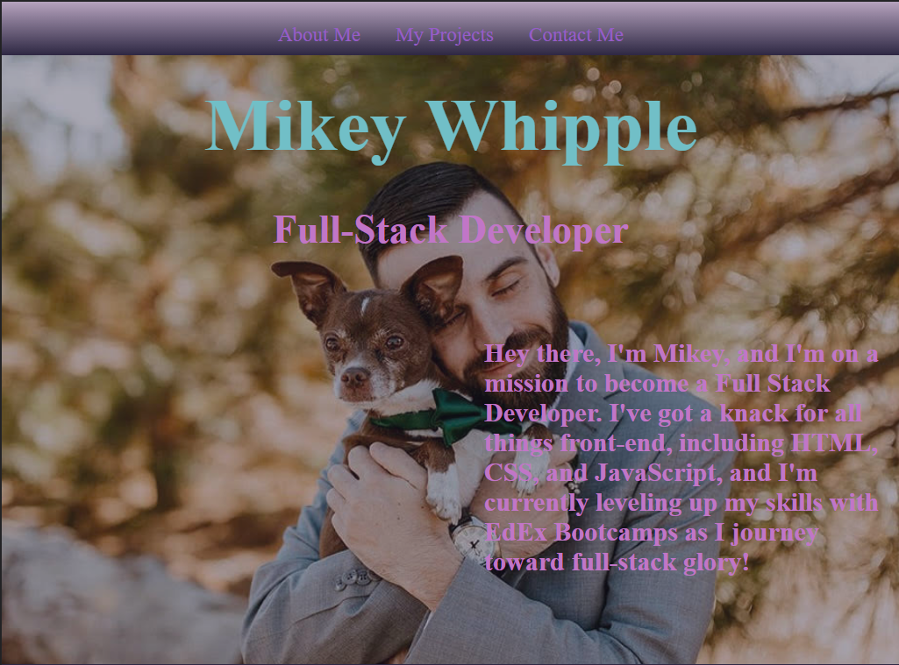
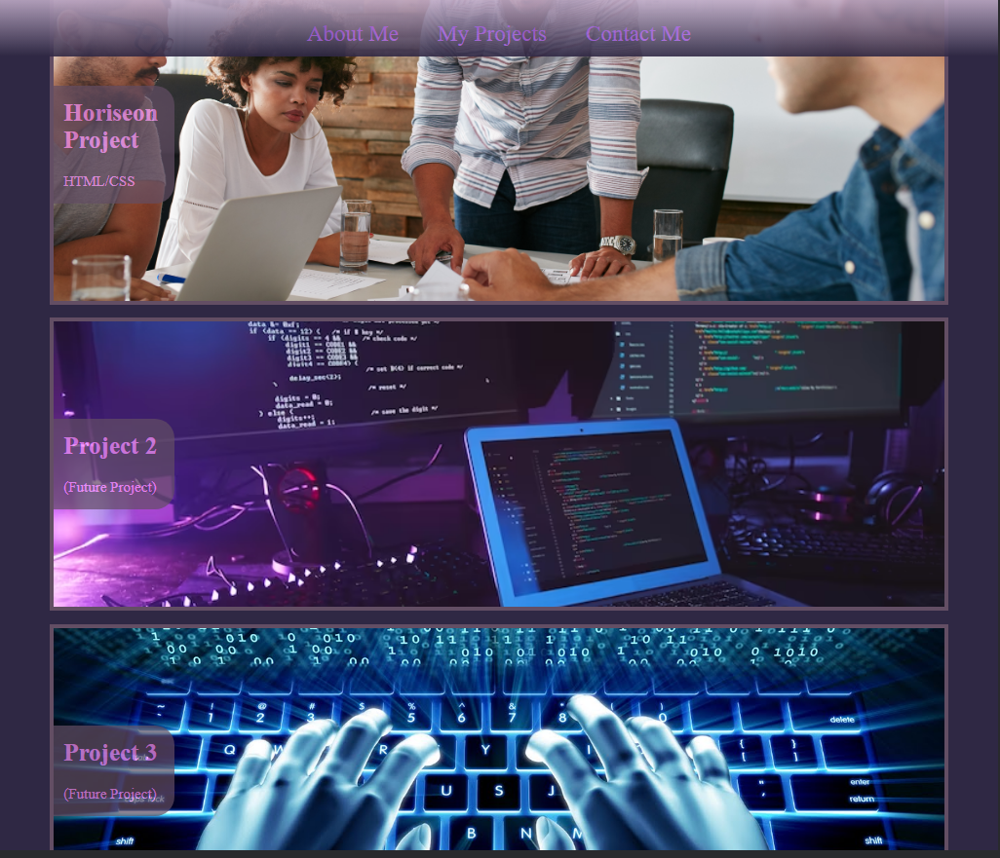

# Mikeys Portfolio

## Overview
This is a early-version of my personal web portfolio that will showcase my wed-design skills as well as projects and achievements made.

## Website Structure
- **Nav Bar**: A responsive navigation bar that provides links to different sections of the portfolio.
- **Project Links**: Displays projects completed by me with relevant details and links to each project.
- **Contact Me Section**: Provides a link to my Github profile.

## Technologies Used
- **HTML**: Used to create the structure of the web page.
- **CSS**: Used for styling and layout, enhancing the visual apperance.
- **Responsive Design**:I built this portfolio with the "mobile-first approach" and it is fully responsive, providing optimal viewing across a wide range of devices.

## Links and Images 
Here are some snapshots of the portfolio:

- **Hero Section**:  
  

- **Project Links Section**:  
  

## Usage 
This Project is meant to be a Portfolio that i will continue to update throughout my web-dev career.

## Website Link
https://empireantz.github.io/week-2-challenge/

✨Created by Mikey Whipple✨
